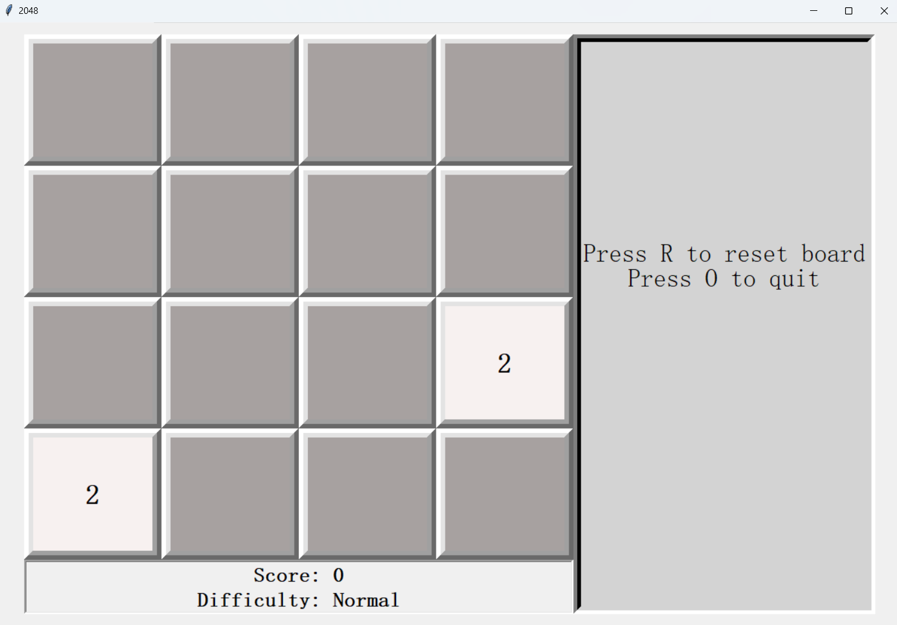

# How to Play 2048

The game 2048 is played on a 4x4 grid composed of spaces which can contain an even
multiple of two or be an empty space. The game begins by filling two random spaces 
with the number 2. The goal of the game is to rearrange and combine the given tiles
until the player combines two tiles to make the number 2048. The player uses the arrow
keys to move all of the existing numbers as far as possible in one direction. Each time
the numbers are moved, a 4 or a 2 appear in a randomly chosen empty space. If the board 
fills up with numbers before the player reaches 2048, the game is over.

# Difficulties
The game comes with three difficulties:
- Easy
- Normal
- Hard

Easy mode is impossible to lose and allows the player to clear all but the highest value
and two descending values from the board.

Normal mode is the standard game.

Hard mode enables the random possibility of two numbers appearing after a move instead of 
just one number appearing.

# Example Starting Board Screen

# Winning Screen

# Game Over Screen

# How to Start the Game
To play, run the command "python3 display.py" in the terminal. The user must input the game
difficulty into the terminal, which will start the game in the display window.